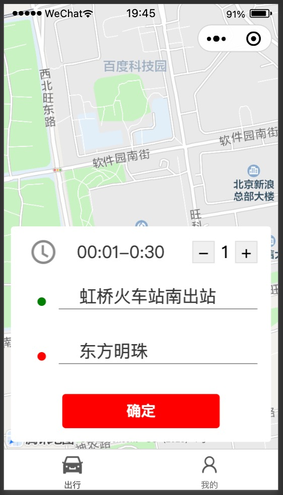
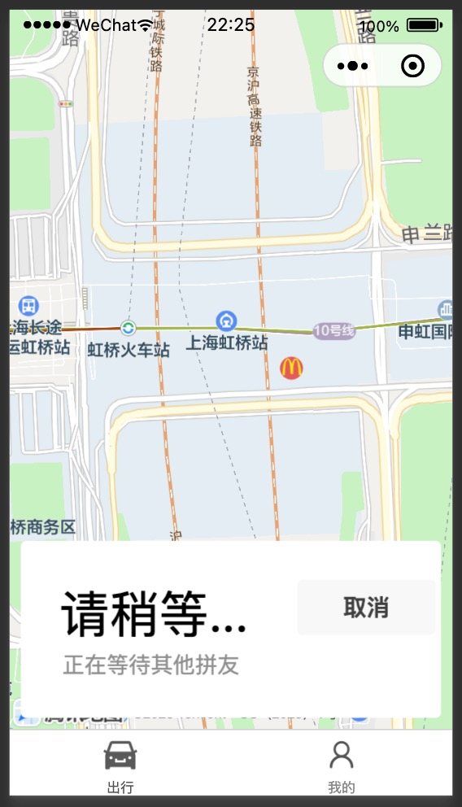

# 如何安装

文本介绍如何启动服务器环境、微信小程序环境，预览效果。

你有3个选择：

Opt1. 使用Docker或PodMan作为运行环境 （会安装Docker Desktop以及 container的运行，难度中等）

Opt2. 直接在本地按照程序的运行环境启动 （要熟悉Java SDK、Node、Keycloak的安装和配置，难度中等）

Opt3. 使用Kubernetes作为运行环境 （会K8s演示环境的搭建与排障，难度高等）


## 快速看效果(Opt1)

技能需求：

1. 会使用docker环境，Docker Desktop或者PodMan
2. 有微信小程序开发工具

启动顺序：

- keycloak
- cotrip
- auth
- 微信小程序

### 启动keycloak

在这个目录中执行。

```bash
docker run -d --name keycloak \
    -e KC_STRICT_HOSTNAME=false \
    -e KC_PROXY=edge \
    -e KEYCLOAK_ADMIN=admin \
    -e KEYCLOAK_ADMIN_PASSWORD=admin \
    -e KEYCLOAK_NEW_USER_DEFAULT_PASSWORD=123456 \
    -p 8089:8080 \
    -v $PWD/base/config/leansd-realm.json:/opt/keycloak/data/import/keycloak-realm.json \
    quay.io/keycloak/keycloak:22.0.1 start-dev --import-realm
```

预期效果：
1. 你应该能在container log中看到：Realm 'leansd' imported
2. 浏览器打开 localhost:8089；点击"Administration Console ";能够使用admin/admin登录keycloak
3. 登录以后能够在左侧上方的下拉框中切换到leansd（默认选择的是admin）

### 启动cotrip

请先clone cotrip工程，进入到工程根目录执行

```bash
#先编译，如果你已经编译过了，可以跳过这一步
#请cd到ctrip工程中执行
docker run -it --rm --name cotrip-build \
 --user $(id -u):$(id -g) \
 -v ~/.m2:/var/maven/.m2:rw \
 -v "$(pwd)":/usr/src/mymaven -w /usr/src/mymaven \
 -e MAVEN_CONFIG=/var/maven/.m2 \
 maven:3.8.6-eclipse-temurin-17-alpine \
 mvn -Duser.home=/var/maven clean package -DskipTests
 ```
```bash
#启动
docker run -it -d --rm --name cotrip \
 --user $(id -u):$(id -g) \
 -v "$(pwd)/target":/var/run -w /var/run \
 -p 8081:8080 \
 maven:3.8.6-eclipse-temurin-17-alpine \
 java -jar cotrip-0.0.1-SNAPSHOT.jar \
 --spring.profiles.active=dev --server.port=8080
```
预期效果：
1. 能在log中看到："Started CotripApplication in ***"
2. `curl localhost:8081/live-check` 能够看到json数组

### 启动Auth

请先clone auth工程，进入到工程根目录执行

```bash
#先编译，如果你已经编译过了，可以跳过这一步
docker run -it --rm --name auth \
 --user $(id -u):$(id -g) \
 -v "$(pwd)":/var/run/ -w /var/run/ \
 -v "$(pwd)/.npm/":/.npm/ \
 -e HOME=$pwd \
 node:18.17.1-bullseye \
 npm install && npm start
```
```bash
#run
docker run -it --rm --name auth \
 --user $(id -u):$(id -g) \
 -v "$(pwd)":/var/run/ -w /var/run/ \
 -v "$(pwd)/.npm/":/.npm/ \
 -p 8848:8848 \
 -e KEYCLOAK_BASE_URL=http://host.docker.internal:8089 \
 -e KEYCLOAK_REALM_NAME=leansd \
 -e KEYCLOAK_ADMIN_CLIENT_ID=admin-cli \
 -e KEYCLOAK_ADMIN_USERNAME=admin \
 -e KEYCLOAK_ADMIN_PASSWORD=admin \
 -e KEYCLOAK_NEW_USER_DEFAULT_PASSWORD=123456 \
 -e KEYCLOAK_AUTH_CLIENT_ID=cotrip \
 -e APP_ID=TODO \
 -e APP_SECRET=TODO \
 node:18.17.1-bullseye \
 npm start
```

预期效果：
1. 能在log中看到："Server started on http://localhost:8848"
2. `curl -v localhost:8848/auth/v1/public-info` 能看到 {"status":"success"}

### 启动微信小程序

在启动微信小程序之前，需要先在微信开发者工具中导入项目。请参考微信小程序的文档。

1. 下载微信小程序开发工具（可能还需要一个开发者账号）
2. 打开小程序开发工具
3. 用导入模式导入项目，小程序id可以选择使用“测试号”，不用申请
4. 👉“信任开发者”
5. 自动编译后，能够看到首屏预览图



注意：在执行其他操作之前，要将auth中的环境变量APP_SECRET与APP_ID填成小程序提供的实际值。

预期效果：
1. 首页加载完毕，在小程序开发工具的网络监控面板中，login接口返回200
2. 点击"开始"，能进入到等待其他拼友界面



   
## 在Kubernetes环境中安装（Opt.3)

### 前提条件

1. 有一个kubernetes 环境 （Docker Desktop、MiniKube、MicroK8s均能帮助搭建K8s学习环境）
2. 开启DNS（Docker Desktop里开启kubernetes后就有）
3. 有ingress-nginx （Docker Desktop不带，要装）

安装ingress：https://kubernetes.github.io/ingress-nginx/deploy/#docker-desktop

### 启动服务器端

提示1： 我们使用leansd做为kubernetes的namespace

    kubectl create ns leansd

提示2： yaml文件使用Kustomize做模板，节省重复的部分。[此为kubectl内置的能力，详情参网站手册](https://kustomize.io/)


提示3：再次强调，不能用于生产或公网访问环境（以防恶意攻击）。 

将deplyemnet应用到leansd空间中

    kubectl apply -k base    

等待启动完全。

key

### 检查启动正常

#### Keycloak能够登录，并看到leansd的realm

1. 将pod端口转出来

    kubectl port-forward -n leansd services/keycloak 8089 

2. 浏览器打开 localhost:8089. 能够使用admin/admin登录keycloak

3. 登录以后能够在左侧上方的下拉框中切换到leansd（默认选择的是admin）

4. 关闭窗口； ctrl-c 关闭端口转发

#### Cotrip能curl到live-api接口

1. Pod端口转出来

    kubectl port-forward -n leansd services/cotrip 8080

2. 有一个api可以get
    
    curl -v localhost:8080/live-check     
    #[{"id":"Alice",...},{"id":"Bob",...}]  

#### Auth能curl到public-info接口

1. Pod端口转出来

    kubectl port-forward -n leansd services/auth 8848 

2. curl api

    curl -v localhost:8848/auth/v1/public-info 
    #{"status":"success"}%             

### 启动用户界面

1. 下载微信小程序开发工具（可能还需要一个开发者账号）
2. 打开小程序开发工具
3. 用导入模式导入项目，小程序id可以选择使用“测试号”，不用申请
4. 👉“信任开发者”
5. 自动编译后，能够看到首屏预览图


### 启动后稍等一会儿

注意：后面的效果需要将小程序源代码中开发环境的地址改成api.leansd.cn

- 安装ingress-controller
- 创建IngressClass=nginx
- apply ingress
- js里面把 host改成 develop: "http://api.leansd.cn"
- 在电脑host里面把这个地址解析到127.0.0.1
```
127.0.0.1 api.leansd.cn
127.0.0.1 kubernetes.docker.internal
```
- auth 依赖 keycloak，keycloak启动完auth才能正常工作。

- ingress配置妥当，可以使用curl看效果：
```
$ curl --resolve "api.leansd.cn:80:127.0.0.1" -i http://api.leansd.cn/live-check 
[{"id":"Alice","createdBy":null,"createdAt":0,"name":null},{"id":"Bob","createdBy":null,"createdAt":0,"name":null}]
```
### 补充说明

Keycloak文档：https://www.keycloak.org/server/containers#_trying_keycloak_in_development_mode
给Docker Desktop安装ingress https://www.michaelrose.dev/posts/k8s-ingress-docker-desktop/
K8s建议的 参数表：https://kubernetes.io/zh-cn/docs/concepts/overview/working-with-objects/common-labels/

